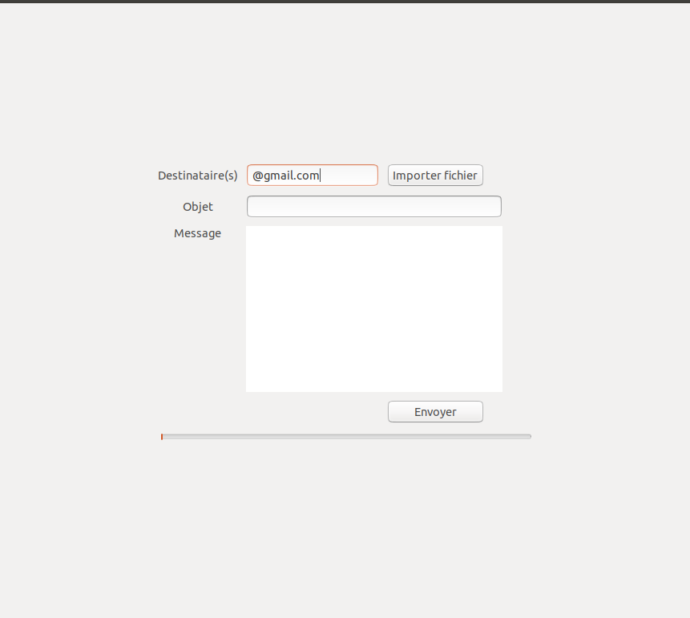

# send_mail_python
Send email in cascade with python3. you can send more thant 500 mails in less than 5 minutes

### Tools used:
 - [x] Python
 - [x] GTK 3
 - [x] Brain :)


### How to have it
make sure that you have gtk3 installed on your machine(Laptop). For my case, I have it on ubuntu 18.04.
The best way for you to install dependencies, it is virtualenvwrapper. How to install it in 1 minute -> [VIDEO](https://youtu.be/Tl3q8Wm0jvI)
```
#for dependencies:
pip install -r requirements.txt

#clone it by typing:
git clone https://github.com/bm777/send_mail_python.git

#run it by typing:
python3 send_mail.py
```

### View of interface



### View of interface when Email sending ends successfully

